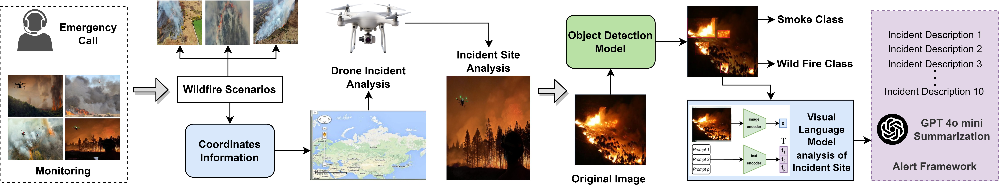
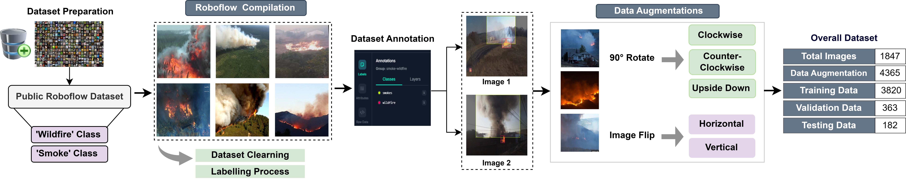

# 🔥 UAV-Based Autonomous Wildfire Detection and Contextual Awareness Using Vision-Language Models and LLM Fusion

<div align="center">


**An autonomous wildfire detection and alert framework combining drone-based surveillance, real-time object detection (YOLOv12n), Vision-Language Models (Moondream2), and LLM-powered emergency alerts (GPT-4o mini).**

[📄 Paper](#citation) · [🚀 Quick Start](#quick-start) · [📊 Results](#results) · [🗂 Dataset](#dataset)

</div>

---

## 📌 Overview

This work presents an end-to-end pipeline for autonomous wildfire monitoring using Unmanned Aerial Vehicles (UAVs). Upon receiving an emergency call or during periodic monitoring, a drone is dispatched to the incident site, captures aerial footage, and the system:

1. **Detects** smoke and wildfire via a fine-tuned **YOLOv12n** object detection model
2. **Describes** the scene using **Moondream2**, a lightweight Vision-Language Model (VLM)
3. **Generates** actionable emergency alerts and situation summaries using **GPT-4o mini**

> **Key capability:** The system operates autonomously from dispatch to alert — with no human in the loop required for initial situation assessment.

---

## 🏗 System Architecture



The pipeline consists of five stages:

| Stage | Component | Description |
|---|---|---|
| 1 | **Input** | Emergency call or periodic monitoring triggers UAV dispatch |
| 2 | **Route Planning** | GPS coordinates guide drone to incident site |
| 3 | **Object Detection** | YOLOv12n detects `smoke` and `wildfire` classes in real-time |
| 4 | **Scene Analysis** | Moondream2 VLM generates natural language description of detected frames |
| 5 | **Alert Generation** | GPT-4o mini fuses detections + descriptions into structured emergency alerts |

---

## 🎬 Qualitative Results


### YOLO Model Comparison

Detection results across YOLOv12n, YOLOv11n, YOLOv10n, and YOLOv9t:


---

## 🗂 Dataset



### Dataset Construction

- **Source:** Public Roboflow wildfire and smoke datasets
- **Classes:** `smokes`, `wildfire`
- **Compilation:** Dataset cleaning, Roboflow compilation, and manual labelling

### Data Augmentation

Applied to increase dataset diversity:
- 90° Clockwise and Counter-Clockwise rotation
- Upside Down flip
- Horizontal and Vertical image flips

### Dataset Statistics

| Split | Count |
|---|---|
| Total Original Images | 1,847 |
| After Data Augmentation | 4,365 |
| Training | 3,820 |
| Validation | 363 |
| Testing | 182 |

---


## 📊 Results

### YOLO Model Comparison on Test Data

| Model | Classes | P | R | mAP@50 | Inf (ms) | Params (M) | GFLOPs |
|---|---|---|---|---|---|---|---|
| **YOLOv12n** | All | 0.649 | 0.628 | 0.628 | **1.8** | 2.52 | **6.3** |
| | Smoke | 0.698 | **0.729** | 0.729 | | | |
| | Wildfire | 0.600 | 0.527 | 0.527 | | | |
| **YOLOv11n** | All | **0.704** | 0.578 | 0.637 | 2.6 | 2.58 | 6.3 |
| | Smoke | 0.754 | 0.674 | 0.721 | | | |
| | Wildfire | **0.654** | 0.482 | 0.552 | | | |
| **YOLOv10n** | All | 0.674 | 0.618 | 0.612 | 3.0 | 2.69 | 8.2 |
| | Smoke | 0.726 | 0.718 | 0.720 | | | |
| | Wildfire | 0.621 | 0.518 | 0.504 | | | |
| **YOLOv9t** | All | 0.644 | **0.645** | 0.660 | 2.7 | **1.97** | 7.6 |
| | Smoke | 0.713 | 0.713 | 0.758 | | | |
| | Wildfire | 0.576 | **0.578** | **0.561** | | | |
| **YOLOv8n** | All | 0.681 | 0.583 | 0.625 | 3.0 | 3.00 | 8.1 |
| | Smoke | 0.735 | 0.680 | 0.710 | | | |
| | Wildfire | 0.626 | 0.487 | 0.540 | | | |
| **YOLOv6n** | All | 0.696 | 0.622 | **0.663** | 2.4 | 4.23 | 11.8 |
| | Smoke | **0.794** | 0.723 | **0.777** | | | |
| | Wildfire | 0.597 | 0.522 | 0.550 | | | |
| **YOLOv5n** | All | 0.636 | 0.589 | 0.618 | 2.3 | 2.50 | 7.1 |
| | Smoke | 0.691 | 0.669 | 0.709 | | | |
| | Wildfire | 0.581 | 0.510 | 0.526 | | | |

> **Bold** values indicate best performance per column. P = Precision, R = Recall, Inf = Inference time per image.

---

## 🚀 Quick Start

### Prerequisites

```bash
git clone https://github.com/YOUR_USERNAME/wildfire-uav-detection.git
cd wildfire-uav-detection
pip install -r requirements.txt
```

### Run Detection on a Single Image

```python
from src.detection.yolo_detector import WildfireDetector

detector = WildfireDetector(weights="weights/yolov12n_wildfire.pt")
results = detector.predict("path/to/image.jpg")
results.show()
```

### Run Full Pipeline (Detection + VLM + LLM Alert)

```python
from src.pipeline import WildfirePipeline

pipeline = WildfirePipeline(
    yolo_weights="weights/yolov12n_wildfire.pt",
    vlm_model="vikhyatk/moondream2",
    openai_api_key="YOUR_KEY"
)

alert = pipeline.run("path/to/drone/frame.jpg")
print(alert)
```

### Run on Video

```bash
python scripts/run_video.py \
  --source path/to/video.mp4 \
  --weights weights/yolov12n_wildfire.pt \
  --output results/output.mp4 \
  --generate-alerts
```

---

## 🛠 Installation

```bash
# Core dependencies
pip install ultralytics          # YOLO models
pip install transformers          # Moondream2 VLM
pip install openai                # GPT-4o mini alerts
pip install roboflow               # Dataset access
pip install opencv-python pillow torch torchvision
```

Or use the provided environment file:

```bash
conda env create -f configs/environment.yml
conda activate wildfire-uav
```

---

## 📁 Repository Structure

```
wildfire-uav-detection/
│
├── figures/                        # Paper figures
│   ├── proposed_fig.jpg            # System architecture diagram
│   ├── fig_m3.jpg                  # Detailed model diagram
│   ├── dataset_2.jpg               # Dataset pipeline
│   ├── yolo_visual_compare.jpg     # YOLO model comparison
│   └── youtube_video_scenarios_1.jpg
│
├── src/
│   ├── detection/
│   │   ├── yolo_detector.py        # YOLOv12n inference wrapper
│   │   └── train.py                # Fine-tuning script
│   │
│   ├── vlm/
│   │   ├── moondream_analyzer.py   # Moondream2 scene description
│   │   └── prompts.py              # VLM prompt templates
│   │
│   ├── llm/
│   │   ├── alert_generator.py      # GPT-4o mini alert generation
│   │   └── prompt_templates.py     # Alert prompt templates
│   │
│   ├── drone/
│   │   ├── route_planner.py        # GPS-based route planning
│   │   └── flight_controller.py    # UAV interface
│   │
│   └── pipeline.py                 # End-to-end pipeline
│
├── configs/
│   ├── yolo_config.yaml            # YOLO training config
│   ├── environment.yml             # Conda environment
│   └── pipeline_config.yaml        # Pipeline parameters
│
├── scripts/
│   ├── prepare_dataset.py          # Dataset download & augmentation
│   ├── train_yolo.py               # Model training script
│   ├── evaluate.py                 # Evaluation & metrics
│   └── run_video.py                # Video inference script
│
├── requirements.txt
└── README.md
```

---

## 🔬 Model Details

### Object Detection — YOLOv12n

- **Architecture:** YOLOv12 nano variant (lightweight, edge-deployable)
- **Fine-tuned on:** Custom smoke + wildfire dataset (3,820 training images)
- **Classes:** `smokes` (blue bounding box), `wildfire` (cyan bounding box)
- **Input size:** 640×640

### Vision-Language Model  

- **Model:** `vikhyatk/moondream2` (Hugging Face)
- **Task:** Generate detailed scene descriptions from YOLO-detected frames
- **Prompting:** Structured prompts asking for spatial information, fire intensity, and environmental context

### LLM Alert Generation  

- **Model:** `gpt-4o-mini`
- **Input:** YOLO detections + Moondream2 descriptions (up to 10 incident descriptions)
- **Output:** Structured alert with:
  - Wildfire Situation Summary (alert level, spread assessment)
  - Emergency Response Guidance (evacuation, resources, coordination)

---

## 🚁 Drone Integration

The framework supports integration with commercial UAVs via the drone interface module:

```python
from src.drone.route_planner import RoutePlanner

planner = RoutePlanner()
route = planner.plan(
    origin=(lat, lon),
    target=(incident_lat, incident_lon),
    altitude=100  # meters
)
```

---


---

## 📜 License

This project is licensed under the MIT License. See [LICENSE](LICENSE) for details.

---

## 🙏 Acknowledgements

- [Ultralytics YOLO](https://github.com/ultralytics/ultralytics) for the YOLOv12 framework
- [Moondream2](https://huggingface.co/vikhyatk/moondream2) for the lightweight VLM
- [Roboflow](https://roboflow.com) for dataset management and augmentation tools
- OpenAI for GPT-4o mini API access
